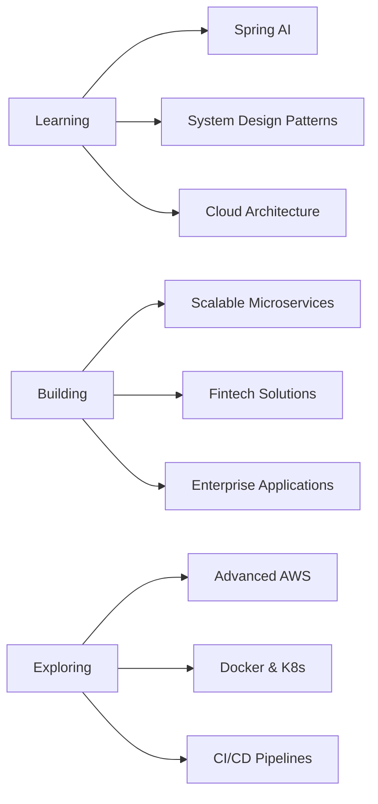

# 👋 Hey there! I'm Raushan Kumar

  
  
  
  

  
  
  
  
  

## 💼 Professional Journey

<b>🏢 Full Stack Developer @ Techcanopy Software Labs</b>

 

**📅 Oct 2023 - Present** | **🚀 FINZY (Fintech Platform)**

+ Designed end-to-end Lender and IFA onboarding APIs → 1000+ monthly onboardings
+ Built comprehensive Loan Management System → 50% reduction in manual KYC
+ Architected investment and portfolio management APIs with real-time tracking
+ Engineered daily ledger and cashflow batch processes
+ Created Java 17 + Spring Boot 3 RegTech library for multi-vendor integration
+ Integrated backend APIs with Angular → Drove business to crores in investments
+ Resolved 100+ critical production issues with zero data inconsistency
  

**🛠️ Tech Stack:** `Java` `Spring Boot` `Spring MVC` `Hibernate` `Angular` `PostgreSQL` `MongoDB` `AWS` `Docker` `Microservices`

<b>💻 SDE Intern @ Salesken.ai</b>

 

**📅 Mar 2023 - Jul 2023** | **🤖 Conversational AI Platform** | 📍 Bengaluru

+ Developed backend APIs with Java & Spring Boot → 30%+ response time reduction
+ Migrated Elasticsearch to PostgreSQL → 40% query performance improvement
+ Integrated Zoho Billing independently

**🛠️ Tech Stack:** `Java` `Spring Boot` `Servlets` `PostgreSQL` `Elasticsearch`

## 🎯 Featured Projects

<table>
<tr>
<td width="50%" align="center">
<!--  -->
  
<h3>💳 FINZY - Fintech Platform</h3>

<strong>Production-grade fintech platform</strong> handling 1000+ monthly onboardings with loan management, investment tracking, and automated cashflow systems

</td>
<td width="50%" align="center">
<!--  -->
  
<h3>🔐 RegTech Validation Library</h3>

<strong>Reusable validation library</strong> for PAN, Aadhaar, CKYC, Bank verification with multi-vendor support and intelligent retry mechanisms

</td>
</tr>
<tr>
<td width="50%" align="center">
 
<h3>🌐 Portfolio Website</h3>

<strong>Personal portfolio</strong> showcasing projects and skills with modern, responsive design

</td>
<td width="50%" align="center">
 
<h3>📊 More Projects</h3>

<strong>Explore more</strong> of my work on GitHub

 

</td>
</tr>
</table>

## 🛠️ Tech Stack

### Languages

### Frameworks & Libraries

### Databases

### Cloud & DevOps

### Tools & Technologies

### Security & APIs

## 📊 GitHub Analytics

## 🎓 Education

**Bachelor of Technology (B.Tech)**  
*Electronics and Communication Engineering*  

🏛️ **University:** Gurukula Kangri Vishwavidyalaya  
📍 **Location:** Haridwar, Uttarakhand  
📅 **Duration:** July 2017 – June 2021  
🎯 **CGPA:** 8.32 / 10

---

## 🏆 Awards & Achievements

### 🥇 Full Stack Web Development
*Masai School — 2023*  
- Complete Java & Spring Boot mastery  
- Angular & RESTful APIs expertise  

### ⭐ Hidden Gem Award of the Year
*Techcanopy Software Labs*

### 🏅 Excellence Awards (4× Consecutive)
*Recognized for outstanding performance & process optimization*

## 🎯 Current Focus & Interests

**🌱 Currently Learning:** Advanced System Design, Spring Cloud, Distributed Systems  
**🔭 Working On:** Production-grade Fintech Platform with 1000+ monthly users  
**👯 Open to Collaborate:** Open Source Java Projects, Full Stack Applications, Microservices Architecture  
**💬 Ask Me About:** Java, Spring Boot, Microservices, Angular, AWS, System Design  
**📫 Reach Me:** raushan376kumar@gmail.com

## 🤝 Let's Connect

  

 

## 🎮 When Not Coding

| 🎵 Playing Music | 📚 Reading Tech Blogs | 🥾 Exploring Nature | 🏍️ Travelling Historic Places |
|:---:|:---:|:---:|:---:|
| Finding rhythm in code | Staying updated | Finding peace | Discovering heritage |

### ⚡ Fun Fact
**You can have some free cookies to eat 🍪😂**

 

 

**💖 Made with love by Raushan Kumar**

 

